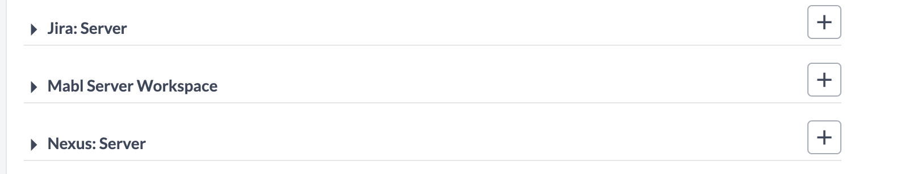

# XL Release Mabl plugin

[![License: MIT][xlr-mabl-plugin-license-image]][xlr-mabl-plugin-license-url]
![Github All Releases][xlr-mabl-plugin-downloads-image]
![Github Build Action][xlr-mabl-plugin-ci-action-image]
![Github Release Action][xlr-mabl-plugin-release-action-image]

[xlr-mabl-plugin-license-image]: https://img.shields.io/badge/License-MIT-yellow.svg
[xlr-mabl-plugin-license-url]: https://opensource.org/licenses/MIT
[xlr-mabl-plugin-downloads-image]: https://img.shields.io/github/downloads/xebialabs-community/xlr-mabl-plugin/total.svg
[xlr-mabl-plugin-release-action-image]: https://github.com/xebialabs-community/xlr-mabl-plugin/actions/workflows/release.yaml/badge.svg
[xlr-mabl-plugin-ci-action-image]: https://github.com/xebialabs-community/xlr-mabl-plugin/actions/workflows/build.yaml/badge.svg

## Preface

This document describes the functionality proved by the xlr-mabl-plugin.

See the **[XL Release Documentation](https://docs.xebialabs.com/xl-release/index.html)** for background information on XL Release and release concepts.

## Requirements

Note:  Digital.ai version should not be lower than lowest supported version. This plugin has been tested with version 10.2.1

## Installation

* Upload the xlr-mabl-plugin via the plugin manager
* Restart XL Release

## Features/Usage/Types/Tasks

This plugin adds a new configuration type, Mabl Server, to the list of available HTTP Connection Server Types.

Before configuring the Mabl Server, create an API Token, of type 'Deployment Trigger Api Key' from [https://app.mabl.com](https://app.mabl.com). Configure the Server URL field with the value used for API calls, namely [https://api.mabl.com](https://api.mabl.com). The 'Test Connection' test associated with the Mabl Server simply makes a call to the url [https://app.mabl.com/login](https://app.mabl.com/login) to ensure Release can reach the Mabl site. Note: The connection test does not test the validity of the API Token.

The Mabl plugin adds the following new tasks types to Release:

* Run Test, Get Result
* Run Test
* Get Result

### Run Test, Get Result

The 'Run Test, Get Result' task will instruct Mabl to run the tests associated with the task configuration of 'Environment', 'Application' and 'Plan Labels'. The task will the wait for the test results and then poll the Mabl server, for as long as necessary.

### Run Test

The 'Run Test' task will instruct Mabl to run test that meet the configured criteria but will not wait for the results. Instead, the task will output a 'testId' value that can be stored in a Release variable. In this way, a future 'Get Result' task can retrieve the test result.

Note: Both the 'Run Test, Get Results' task and the 'Run Test' task must have either or both of the 'Environment' and 'Application' fields populated. The 'Plan Labels' list is optional.

### Get Result

Given a testId, the 'Get Result' task will poll Mabl to retrieve test results. 

## Testing the plugin

This project contains a docker-compose file and configuration yaml files so that you can spin up a version of Release with the Mabl plugin installed and then use the XL CLI to import configuration files to create a test scenario. You will need to create the src/test/resource/docker/initialize/yaml/xebialabs/secrets.xlvals file to hold the value of your API Token. You will also need to edit the xlr-configuration.yaml file to replace the environment, application and plan labels values with values that match your Mabl account configuration.
[XL CLI documentation](https://docs.digital.ai/bundle/devops-release-version-v.10.3/page/release/concept/xl-cli-command-reference.html)

