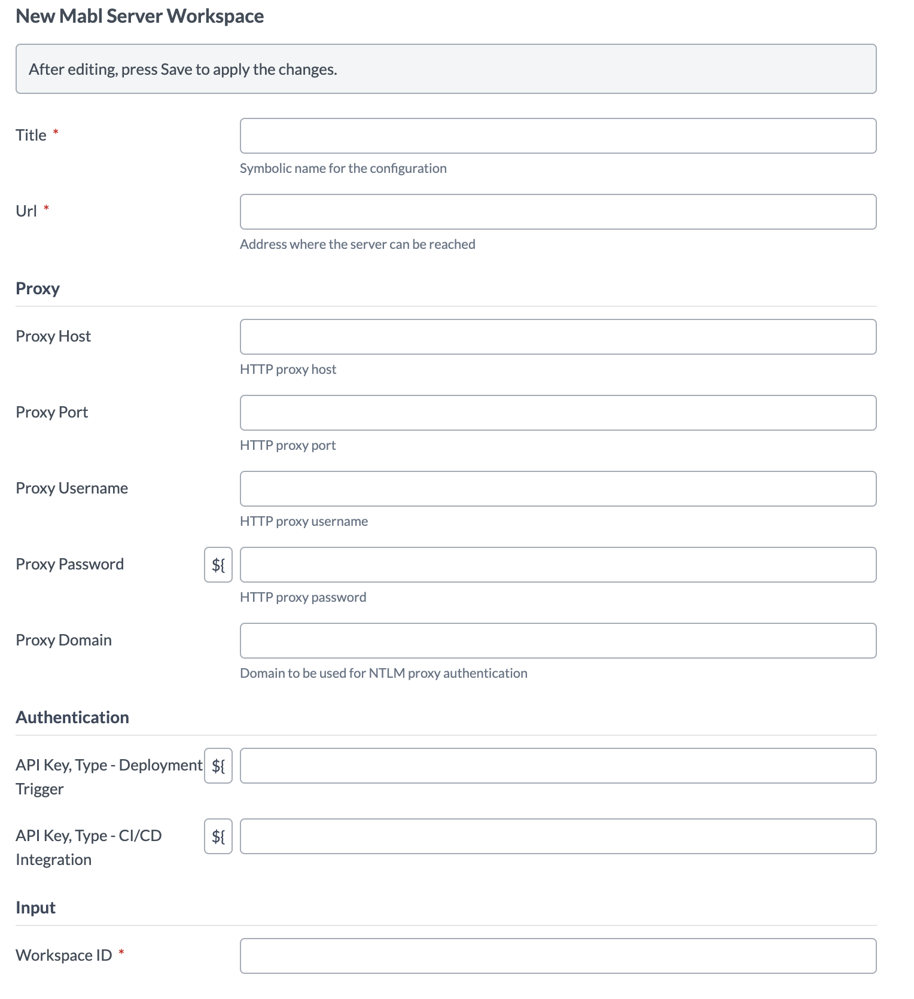
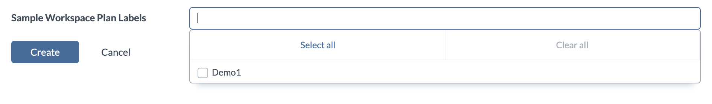

# XL Release Mabl plugin

[![License: MIT][xlr-mabl-plugin-license-image]][xlr-mabl-plugin-license-url]
![Github All Releases][xlr-mabl-plugin-downloads-image]
![Github Build Action][xlr-mabl-plugin-ci-action-image]

[xlr-mabl-plugin-license-image]: https://img.shields.io/badge/License-MIT-yellow.svg
[xlr-mabl-plugin-license-url]: https://opensource.org/licenses/MIT
[xlr-mabl-plugin-downloads-image]: https://img.shields.io/github/downloads/xebialabs-community/xlr-mabl-plugin/total.svg
[xlr-mabl-plugin-release-action-image]: https://github.com/xebialabs-community/xlr-mabl-plugin/actions/workflows/release.yaml/badge.svg
[xlr-mabl-plugin-ci-action-image]: https://github.com/xebialabs-community/xlr-mabl-plugin/actions/workflows/build.yaml/badge.svg

## Preface

This document describes the functionality proved by the xlr-mabl-plugin.

See the **[XL Release Documentation](https://docs.digital.ai/bundle/devops-release-version-v.22.1/page/release/how-to/get-started-with-xl-release.html)** for background information on XL Release and release concepts.

## Requirements

Note:  Digital.ai version should not be lower than lowest supported version. This plugin has been tested with version 10.2.1

## Installation

* Upload the xlr-mabl-plugin via the plugin manager
* Restart XL Release

## Features/Usage/Types/Tasks

This plugin adds a new configuration type, Mabl Server Workspace, to the list of available HTTP Connection Server Types. You must create a Mabl Server Workspace for each workspace you wish to interact with even if they reside on the same Mabl server.

Before configuring the Mabl Server Workspace, create two API Tokens, one of type 'Deployment Trigger Api Key' from [https://app.mabl.com](https://app.mabl.com) and one of type CI/CD Integration. Configure the Server URL field with the value used for API calls, namely [https://api.mabl.com](https://api.mabl.com). The screenshot below shows the page within the Mabl App where tokens can be created.

You will also need to know the workspace id. The screenshot below shows where to find the workspace id within the Mabl App.

Note: The 'Test Connection' test associated with the Mabl Server Workspace simply makes a call to the url [https://app.mabl.com/login](https://app.mabl.com/login) to ensure Release can reach the Mabl site. Note: The connection test does not test the validity of the API Tokens or the Workspace Id.

The Mabl plugin adds the following new tasks types to Release:

* Run Test, Get Result
* Run Test
* Get Result

### Run Test, Get Result

The 'Run Test, Get Result' task will instruct the configured Mabl Server Workspace to run the tests associated with the task configuration of 'Environment', 'Application' and 'Plan Labels'. The task will then wait for the test results by polling the Mabl server, for as long as necessary.

### Run Test

The 'Run Test' task will instruct the configured Mabl Server Workspace to run tests that meet the configured criteria but will not wait for the results. Instead, the task will output a 'testId' value that can be stored in a Release variable. In this way, a future 'Get Result' task can retrieve the test result.

Note: Both the 'Run Test, Get Results' task and the 'Run Test' task must have either or both of the 'Environment' and 'Application' fields populated. The 'Plan Labels' list is optional.

### Get Result

Given a testId, the 'Get Result' task will poll Mabl to retrieve test results. 

### Use a Value Provider to Set Environment, Application and Plan Labels

Instead of manually entering the application, environment and/or plan labels, you can configure the 'Run Test, Get Result' or 'Run Test' tasks to use a Template Release Variable that will be pre-populated by a Value Provider. The Value Provider will query the configured Mabl Server Workspace to retrieve all of possible environment, application and plan label values. When a release is created you can then choice the specific values to assign to the Release Variables. Follow the steps below to create and use a Release Variable pre-populated by a Value Provider. 

#### Create a Template Release Variable to Display All Possible Environments

1. Create a Release Variable at the Template level of type List box
2. This variable will be populated with environment ids from a single Mabl Server Workspace. It is a good practice name and label the variable so that the workspace association is clear.
3. Choose the Value Provider type 'Value Provider'.
4. From the Script Value Provider drop down list, choose Mabl Environments Value Provider.
5. Choose the Mabl Server Workspace
6. Make sure 'Show on Create Release Form' is checked. Do not check the 'Required' checkbox.
7. Within the template, assign the variable you have just created to the task 'Environment Id' entry
8. NOTE: Be sure your task and your Release Variable are both assigned to work within the same Mabl Server Workspace
9. When you create the new release, you will be able to choose the specific Environment Id to use in the task

#### Create a Template Release Variable to Display All Possible Applications

1. Create a Release Variable at the Template level of type List box
2. This variable will be populated with application ids from a single Mabl Server Workspace. It is a good practice name and label the variable so that the workspace association is clear.
3. Choose the Value Provider type 'Value Provider'.
4. From the Script Value Provider drop down list, choose Mabl Applications Value Provider.
5. Choose the Mabl Server Workspace
6. Make sure 'Show on Create Release Form' is checked. Do not check the 'Required' checkbox.
7. Within the template, assign the variable you have just created to the task 'Application Id' entry.
8. When you create the new release, you will be able to choose the specific Application Id to use in the task.

#### Create a Template Release Variable to Display All Possible Plan Labels

1. Create a Release Variable at the Template level of type Multi-Select List box. NOTE: This is a different type than the type used for the environment and application value providers.
2. This variable will be populated with plan labels from a single Mabl Server Workspace. It is a good practice name and label the variable so that the workspace association is clear.
3. Choose the Value Provider type 'Value Provider'.
4. From the Script Value Provider drop down list, choose Mabl Plan Labels Value Provider.
5. Choose the Mabl Server Workspace
6. Make sure 'Show on Create Release Form' is checked. Do not check the 'Required' checkbox.
7. Within the template, assign the variable you have just created to the task 'Plan Labels' entry. You will need to click the variable symbol displayed after the entry field labels so that you can choose the correct variable from the drop down list.
8. When you create the new release, you will be able to choose the specific Plan Labels to use in the task.

#### Tips for using Value Provider Release Variables

When you create the new release, you will have an opportunity to choose the actual environment, application and plan labels. When the release is first created, the Value Provider scripts run and the workspace is queried for environment, application and plan labels. It may take a moment for the drop down lists and multi-select list to populate. When the queries are complete, the cursor will change from an arrow to a hand symbol and a drop down symbol will be displayed when you click the entry box. Choose a value from the drop down list. You can choose multiple Plan Label values. It is important that Mabl Server Workspace associated with the Variable and the Release Task are the same. If your Release has tasks that work with various Mabl Server Workspaces, create multiple Value Provider Release Variable associated with the various Workspaces. Be sure to label them clearly to prevent confusion.

Note: The values for environments and applications include both the ids and the names. This is done for convenience. The plugin will process the string, parse out the id and send only the id to the Mabl Server Workspace.

## Testing the plugin

This project contains a docker-compose file and configuration yaml files so that you can spin up a version of Release with the Mabl plugin installed and then use the XL CLI to import configuration files to create a test scenario. You will need to create the src/test/resource/docker/initialize/yaml/xebialabs/secrets.xlvals file to hold the value of your API Token. You will also need to edit the xlr-configuration.yaml file to replace the environment, application and plan labels values with values that match your Mabl account configuration.
[XL CLI documentation](https://docs.digital.ai/bundle/devops-release-version-v.10.3/page/release/concept/xl-cli-command-reference.html)

